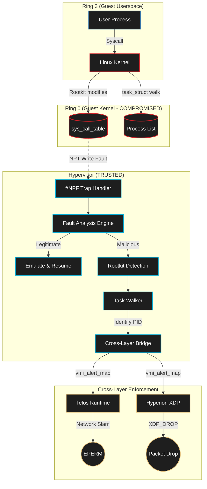

# Sentinel VMI

### KVM-backed VMI Mediation Engine

<p align="center">
  
  
  
  
  
</p>

> **Status:** Experimental prototype (alpha)

## Threat Model

Sentinel VMI protects against fully compromised Ring 0 (kernel) operating systems, specifically targeting advanced rootkits and malicious firmware behavior.
**In Scope**: Kernel `sys_call_table` modifications, hidden processes, and unauthorized direct memory access (DMA).
**Assumptions**: The Hypervisor is trusted, isolated from the guest, and possesses an uncorrupted view of the hardware state. Nested Virtualization capabilities in the CPU are functional and secure.
**Out of Scope / Limitations**: Hypervisor breakout vulnerabilities (VM escape) and microarchitectural side-channels (e.g., Spectre, Meltdown) are out of scope.

---

Sentinel VMI is the hypervisor-assisted introspection layer of the unified Sentinel Stack. It operates below the Linux kernel using AMD-V hardware virtualization extensions and ARMv8 EL2 Virtualization Extensions. It assumes the guest OS is already compromised and enforces security from outside the trust boundary entirely.

---

## What is Sentinel VMI? (The Simple Version)

Imagine the operating system kernel (Ring 0) is a vault inside a high-security building. If a rootkit gets inside the vault and locks the doors, traditional security cameras inside the vault can be turned off or blinded by the attacker.

**Sentinel VMI puts the cameras inside the concrete walls and foundation of the building itself (The Hypervisor).** Even if a rootkit takes total control of the operating system kernel, it is physically impossible for the rootkit to detect or disable Sentinel VMI, because Sentinel VMI controls the very hardware the kernel is running on.

- The hypervisor marks the kernel's `sys_call_table` as **read-only at the hardware level** (Nested Page Tables)
- If a rootkit attempts to overwrite it, the CPU triggers a **hardware fault (#NPF)** that Sentinel VMI intercepts
- The rootkit's PID is identified and pushed to **Hyperion XDP** for low-latency network isolation
- The compromised process is flagged in **Telos Runtime** to trigger an immediate **Network Slam**

> [!IMPORTANT]
> The primary assumption of Sentinel VMI is that the guest operating system is **entirely compromised**. All telemetry generated by the guest kernel is considered inherently untrustworthy. Enforcement and introspection occur completely outside the guest's execution context, relying strictly on hardware-enforced memory translation regimes and architectural fault exceptions.

---

## How It Works (Technical Deep Dive)

Sentinel VMI operates at the Hypervisor Exception Level (EL2 on ARMv8 or root mode on AMD-V). It leverages architectural registers to safely manipulate the guest environment, strictly controlling how the guest interprets memory.

### Architecture



### The Four-Phase Architecture

Sentinel VMI is engineered in four progressive phases, each building on the previous:

**Phase 1: Raw Memory Introspection**
- KVM file descriptor management and kvmi-v7 API handshake
- Raw guest physical memory dump via `kvmi_read_physical()`
- Page table walker for guest virtual to physical address translation
- Guest physical address is not host physical address; KVM memslots are required to translate

**Phase 2: Semantic Gap Bridging**
- BTF-first offset loader with kernel-profile fallback for `task_struct` parsing
- Process list walker from `init_task` through the entire linked list
- Expanded extraction: PID, TGID, PPID, `comm`, `mm`, files, namespaces, start time, flags
- Credential parsing: uid/gid/euid/egid/capabilities
- Behavioral analytics: privilege transitions, orphan tasks, fork-bomb patterns, suspicious ancestry

**Phase 3: NPT Guard (The Core Innovation)**
- Nested Page Table manipulation via KVM ioctl
- `sys_call_table` physical address resolution and NPT entry modification to mark page read-only at hypervisor level
- `#NPF` (Nested Page Fault) trap handler with fault analysis to distinguish legitimate kernel writes from rootkit modifications
- Multi-region integrity baseline with periodic hash revalidation
- Optional IDT/GDT/LSTAR/kernel_text guard regions via runtime configuration

**Phase 4: Cross-Layer Bridge**
- Malicious PID detection from Phase 2 + Phase 3 combined
- Pinned eBPF map `vmi_alert_map` for cross-layer signal propagation (PID to threat_level)
- Signal to Hyperion XDP for low-latency drops on malicious PIDs
- Signal to Telos Runtime for taint elevation to `TAINT_CRITICAL`
- Producer orchestration policy with dedup and suspicious burst escalation

> [!NOTE]
> Even a fully compromised kernel CANNOT modify `sys_call_table`. The hardware enforces the write protection. No kernel-level bypass exists because the enforcement originates from a higher privilege level than Ring 0.

### Cross-Layer Signal Flow

```
VMI detects rootkit write to sys_call_table
  -> identifies malicious PID via task_struct walk
  -> writes PID to vmi_alert_map
  -> Hyperion XDP reads map -> XDP_DROP all packets from PID
  -> Telos Runtime reads map -> Network Slam
  -> Zero bytes leave the machine
```

---

## Stage 2 Memory Translation Mechanics

In AArch64/ARMv8 architectures, the hypervisor operates at EL2 and leverages Stage 2 memory translation. This regime dictates how the hypervisor maps Intermediate Physical Addresses (IPAs) to the actual hardware Physical Addresses (PAs).

This abstraction follows the translation path: `VA -> IPA -> PA`

The hypervisor manipulates specific EL2 system registers:
- **`VTCR_EL2` (Virtualization Translation Control Register):** Controls the translation table walks required for stage 2 translation of memory accesses from Non-secure EL0 and EL1. Holds cacheability and shareability information. The `HD` bit controls hardware management of the Access flag and dirty bit state. The `SL2` field dictates the starting level of the stage 2 translation lookup.
- **`VTTBR_EL2` (Virtualization Translation Table Base Register):** Holds the base address of the translation tables utilized during the walk.

### Stage 2 Access Permissions (S2AP)

The `S2AP` field dictates the read, write, and execute constraints applied to guest memory pages at the hypervisor level. Sentinel VMI enforces these permissions to establish trapping mechanisms for sensitive kernel regions.

| S2AP[1:0] Encoding | Hardware Interpretation | Sentinel-VMI Enforcement Strategy |
|:----|:------|:------|
| `0b00` | No access permitted from lower Exception Levels | Completely isolates highly sensitive hypervisor pages from the guest OS |
| `0b01` | Read/Write access permitted | Standard memory mapping applied to general guest OS data segments |
| `0b10` | Read-only access permitted | Enforced on guest code pages to ensure execution integrity and trap unauthorized modifications |
| `0b11` | Read-only access permitted | Redundant read-only state utilized for specific trap-and-emulate topologies |

### The HPFAR_EL2 Permission Fault Anomaly

When a memory access violates the S2AP constraints, a synchronous exception is triggered and routed to EL2. The hypervisor relies on `ESR_EL2` (Exception Syndrome Register) for fault cause information and `HPFAR_EL2` (Hypervisor IPA Fault Address Register) for the faulting IPA.

> [!WARNING]
> **Architectural Errata:** According to the ARM Architecture Reference Manual, the value of `HPFAR_EL2` becomes `UNKNOWN` or architecturally invalid if the Stage 2 fault does not occur during a Stage 1 translation table walk. This is specifically the case during a Stage 2 permission fault. Attempting to read this invalid address will result in a catastrophic hypervisor panic.

Sentinel VMI implements an explicit manual address translation fallback:
1. Read the faulting virtual address from `FAR_EL2`
2. Issue `AT S1E1R` (Address Translate Stage 1 EL1 Read) to simulate the Stage 1 translation using the guest's regime
3. Extract the physical address (the IPA) from `PAR_EL1` (Physical Address Register)

**Fallback Execution Path:** `FAR_EL2` -> `AT S1E1R` -> `PAR_EL1` -> `IPA`

> [!NOTE]
> Because Stage-1 translation already validated the memory access rights prior to the Stage 2 abort, the hypervisor can safely utilize the EL1 translation regime and does not need to distinguish between EL0 and EL1 access privileges during this manual translation phase.

---

## Features

| Feature | Description |
|:--------|:-----------|
| Raw Memory Introspection | Read guest physical memory via KVM mediation without trusting the guest OS |
| Memory Layout Parsing | Parse meaningful kernel data structures from raw bytes via BTF-first offsets |
| NPT Guard | Hardware write-protection of sys_call_table via Nested Page Tables |
| #NPF Trap Handler | Real-time detection of rootkit modifications through hardware fault analysis |
| Multi-Region Integrity | Periodic hash revalidation of kernel_text, IDT, GDT, and LSTAR |
| Behavioral Analytics | Detection of privilege transitions, orphan tasks, fork-bomb patterns |
| Cross-Layer Bridge | Automatic PID propagation to Hyperion XDP and Telos Runtime |
| Heki IPC | Hypervisor-Enforced Kernel Integrity via Unix Domain Socket bridge |
| Drawbridge Protocol | Cryptographic CPUID nonce verification for safe map mutations |

---

## Cross-Layer Signals (What Other Projects Expect)

**Hyperion XDP expects:**

| Field | Type | Description |
|:------|:-----|:-----------|
| Map name | `vmi_alert_map` | Pinned eBPF hash map |
| Key | `uint32_t` | Process ID (PID) |
| Value | `uint32_t` | Threat level: 1=suspicious, 2=malicious |

**Telos Runtime expects:**

| Field | Type | Description |
|:------|:-----|:-----------|
| Endpoint | `localhost:8421/vmi/alert` | gRPC alert stream |
| Payload | `{pid, threat_type, confidence}` | Alert schema |
| Bridge helper | JSONL | Includes threat_level, timestamp_ns, reason |

---

## Getting Started

### Prerequisites

- AMD processor with AMD-V (SVM) and Nested Page Table (NPT) support
- Linux Kernel 6.x with kvmi-v7 patchset applied
- KVM enabled (`CONFIG_KVM`, `CONFIG_KVM_AMD`, `CONFIG_KVM_INTROSPECTION=y`)
- `libkvmi` userspace library
- `libbpf` for cross-layer eBPF map access
- GCC 11+ or LLVM/Clang 12+

### Building

```bash
git clone https://github.com/nevinshine/sentinel-vmi.git
cd sentinel-vmi

# Standard build
make all

# Build with libbpf bridge support (Phase 4)
make USE_BPF=1

# Run unit tests
make test
```

### Running

> [!CAUTION]
> ALL VMI kernel experiments must run inside a nested KVM Virtual Machine. Execution on bare-metal host operating systems is strictly prohibited during development to prevent catastrophic host panics. The feedback loop for errors at the hypervisor level is a kernel panic and hard reboot with no error messages and no debugger.

```bash
# Set up the nested KVM VM
./scripts/setup_vm.sh

# Build the custom kernel with kvmi-v7 patches
./scripts/build_kernel.sh

# Run the VMI engine inside the nested VM
sudo ./sentinel-vmi
```

---

## Project Structure

```
sentinel-vmi/
├── src/
│   ├── main.c              # Entry point, VMI session management
│   ├── kvmi_setup.c        # KVM introspection API setup and handshake
│   ├── memory.c            # Guest physical memory access via kvmi
│   ├── task_walker.c       # task_struct parsing and process list walker
│   ├── npt_guard.c         # Nested Page Table manipulation via KVM ioctl
│   ├── npf_handler.c       # #NPF fault trap and analysis engine
│   ├── bridge.c            # Cross-layer eBPF map signaling to Telos/Hyperion
│   ├── heki_server.c       # Heki IPC Unix Domain Socket server
│   └── cpuid_handler.c     # CPUID Drawbridge nonce handler
├── include/
│   ├── sentinel_vmi.h      # Shared definitions
│   ├── task_offsets.h       # task_struct field offsets by kernel version
│   └── vmi_alert_map.h     # Shared map definition with Hyperion/Telos
├── tests/
│   ├── test_memory.c       # Phase 1 tests
│   ├── test_task_walker.c  # Phase 2 tests
│   ├── test_npt.c          # Phase 3 tests
│   └── test_bridge.c       # Phase 4 tests
├── scripts/
│   ├── build_kernel.sh     # Custom kernel build script
│   ├── setup_vm.sh         # Nested KVM VM setup
│   └── run_tests.sh        # Full test suite
├── .github/
│   └── workflows/
│       └── vmi-build.yml   # GitHub Actions kernel build CI
├── docs/
│   ├── threat-model.md     # VMI-specific threat model
│   ├── architecture.md     # Phase-by-phase architecture
│   └── setup.md            # How to build the custom kernel
├── Makefile
└── README.md
```

---

## Engineering Phases

<details>
<summary><b>Phase 1: Raw Memory Introspection</b> — Read guest memory via KVM</summary>

- KVM file descriptor management and kvmi API setup
- Raw guest physical memory dump via `kvmi_read_physical()`
- Page table walker for guest virtual to physical translation
- Guest physical address != host physical address; KVM memslots translate

</details>

<details>
<summary><b>Phase 2: Memory Layout Parsing</b> — Parse kernel structures from raw bytes</summary>

- BTF-first offset loader with kernel-profile fallback
- Process list walker (`init_task` -> all processes via linked list)
- Expanded extraction: PID/TGID/PPID, comm, mm, files, namespaces, flags
- Credential parsing (uid/gid/euid/egid/capabilities)
- Behavioral analytics: privilege transitions, orphan tasks, fork-bomb patterns

</details>

<details>
<summary><b>Phase 3: NPT Guard</b> — Hardware sys_call_table protection</summary>

- Nested Page Table manipulation via KVM ioctl
- `sys_call_table` physical address resolution and NPT write-protection
- `#NPF` trap handler with fault classification (legitimate vs rootkit)
- Multi-region integrity baseline and periodic hash revalidation
- Optional IDT/GDT/LSTAR/kernel_text guard regions

</details>

<details>
<summary><b>Phase 4: Cross-Layer Bridge</b> — Connect VMI to the Sentinel Stack</summary>

- Malicious PID detection from Phase 2 + Phase 3
- Pinned `vmi_alert_map` eBPF map for cross-layer propagation
- Signal to Hyperion XDP for low-latency drops
- Signal to Telos Runtime for taint elevation
- Producer orchestration with dedup and burst escalation
- Resilient TCP transport with reconnect backoff

</details>
<details>
<summary><b>Phase 15: Execution Authority Attribution</b> — Causal mapping of semantic lineage</summary>

- `struct execution_authority` introduced to bind hardware isolation directly to semantic continuity.
- Maps capability evolution (`CAP_NAMESPACE_TRANSITION`, `CAP_PTRACE_FOREIGN`) natively.
- Evaluates temporal capability drift and topology anomalies.

</details>

<details>
<summary><b>Phase 16: Distributed Semantic Coherence</b> — Global field thermodynamics</summary>

- Sentinel transitions from actor-local introspection to a system-wide semantic governance model.
- Introduces `struct semantic_field` tracking capability pressure, authority entropy, and centralization.
- Thermodynamic variables (`semantic_inertia`, `semantic_temperature`) decay mathematically per `semantic_epoch`.

</details>

<details>
<summary><b>Phase 17: Semantic Conservation & Field Closure</b> — Enforcing mathematical closure laws</summary>

- Applies formal execution physics equations to the VM state.
- Computes `conservation_delta`, proving mathematically whether `authority_mass` emerged legally.
- Implements `authority_curvature` across topological execution edges.
- Enforces strict execution closure states: `FIELD_COHERENT` -> `FIELD_COLLAPSING` -> `FIELD_IRRECOVERABLE`.

</details>

<details>
<summary><b>Phase 18: Predictive Semantic Collapse</b> — Counterfactual topology projections</summary>

- Sentinel mathematically estimates trajectory stability (`struct semantic_trajectory`).
- Calculates `trajectory_curvature` as the 2nd derivative of divergence `d²(divergence)/d(epoch²)`.
- Identifies `escape_velocity` natively from execution geometry.
- Tracks **Observer Effect** dominance: mathematically guarantees Sentinel's own interventions (`#PF` traps, quarantines) do not artificially collapse the execution topology.

</details>

<details>
<summary><b>Phase 19: Counterfactual Stabilization Theory</b> — Minimum-energy topology repair</summary>

- Transforms Sentinel from a security monitor into an autonomous runtime topology regulator. 
- Performs zero-latency differential counterfactual replay over multiple hypothetical intervention candidates (Observe, Throttle, Quarantine, Freeze).
- Automatically selects the stabilization chain that requires the lowest `intervention_minimality` while preserving `recovery_integrity`.
- Formalizes **Observer Dominance**: If regulatory force introduces more topological distortion than it resolves, Sentinel enforces a less destructive stabilization path.

</details>

<details>
<summary><b>Phase 20: Autonomous Equilibrium Steering</b> — Continuous semantic homeostasis</summary>

- Graduates Sentinel into a continuous homeostasis engine governed by two distinct control loops.
- **Fast Path** (micro-timescale) handles EPT/MSR traps with zero-latency topological tensor updates (shear, resonance, friction, flux) without running heavy counterfactual solving.
- **Slow Path** (macro-timescale) runs asynchronously, continuously evaluating attractor states and applying minimum-energy micro-corrections only when the topology escapes structural deadzones.
- Dynamically classifies attractors using topological scars, allowing Sentinel to differentiate `ATTRACTOR_HEALTHY` stability from `ATTRACTOR_PARASITIC` (a stable rootkit) via causal conservation ancestry.

</details>
---

## Architecture and Interoperability Matrix

| Execution Layer | Sentinel Component | Primary Technology & Enforcement | Strategic Objective |
|:------|:------|:------|:------|
| **Hypervisor (KVM)** | **`sentinel-vmi`** | AMD-V / NPT Guard / ARMv8 EL2 | Out-of-band Hypervisor Introspection, memory monitoring |
| Ring 0 (Compile) | `sentinel-cc` | LLVM / Policy-Carrying Code | Compile-time intent validation, Call-Stack CFI, ASLR-aware enforcement |
| Ring 0 (Runtime) | `telos-runtime` | eBPF-LSM | Intent correlation, Information Flow Control (IFC), and Taint Tracking |
| Ring 0 (Runtime) | Sentinel RT | Seccomp / eBPF / io_uring | Host Intrusion Detection System (HIDS), Citadel recursive tracking |
| Wire / Physical NIC | `hyperion-xdp` | XDP / eBPF | Low-latency network drop and proxy enforcement |

---

## Building & Development

### Prerequisites

- Linux Kernel >= 5.15 (with `CONFIG_KVM` enabled)
- `gcc` / `clang`
- `make`
- `libelf-dev`
- Optional: `libbpf-dev` (for cross-layer eBPF signaling)

### Build Commands

```bash
make all            # Full build
make USE_BPF=1      # Build with libbpf bridge
make test           # Run all unit tests
make clean          # Clean build artifacts
```

---

## License

GPL License — see [LICENSE](LICENSE).

---

<p align="center">
  <b>Sentinel VMI</b> — <em>Because hardware enforces what software cannot.</em>
</p>
