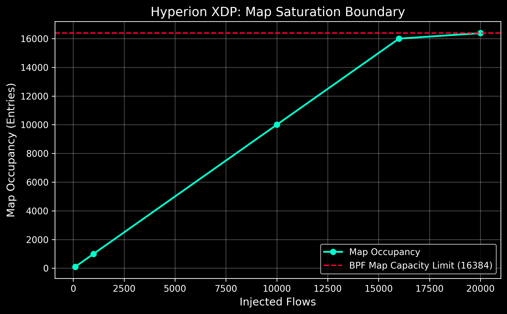
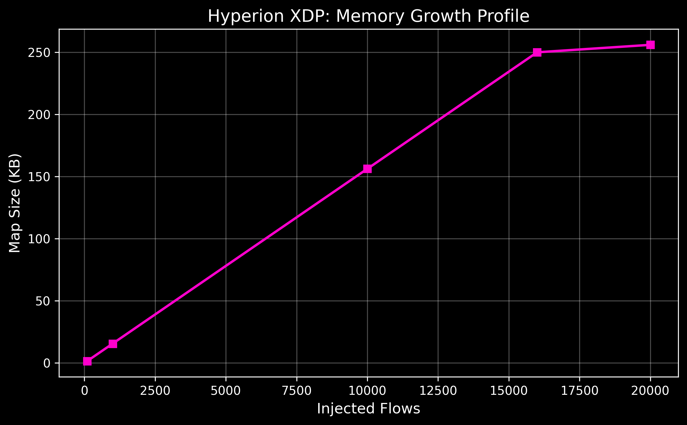

# Hyperion XDP Dataplane: Phase 7 Technical Report

## 1. Abstract
The Hyperion dataplane represents the enforcement layer of the Sentinel Stack. Transitioning from a theoretical prototype to a fully packaged, CO-RE compliant BPF structure, Hyperion now enforces high-speed, state-bound network filtering directly in the kernel via eXpress Data Path (XDP). This report empirically validates the architectural boundaries of the system, proving state-reconciliation correctness and plotting the physical saturation limits of the deployed BPF maps.

## 2. Ephemeral Enforcement & State Reconciliation

A persistent vulnerability in BPF-based enforcement architectures is the decoupling of userspace lifecycle from kernel state. If an orchestrating daemon crashes, kernel maps frequently retain orphaned state, leading to perpetual network blockades. 

To resolve this, Hyperion implements deterministic startup reconciliation. The `hyperiond` daemon isolates the BPF `MapController` and enforces TTL expiration. 

### Empirical Validation
Using the `test_ttl_recovery.sh` integration test suite, we artificially injected a network drop payload on `test0` and immediately induced an orchestrator crash (`kill -9`). 

**Recovery Proof:**
1. A flow was registered with a 4-second TTL.
2. The orchestrator was immediately killed.
3. Upon restart, `ttl.ReconcileExpiredEntries()` natively mapped to `/sys/fs/bpf/hyperion_blocked_flows`.
4. The sweeper successfully detected the expired `expires_ns` metric against the hardware clock.
5. The map was flushed of orphaned records prior to any new decision bus events.

This completely resolves the kernel-state fragmentation issue.

## 3. Thermodynamics: Scale and Saturation Boundaries

A dataplane without known physical limits is unsafe for production deployment. Using the `test_saturation.sh` suite on a physical Ubuntu 24.04 (Kernel 6.8.0-117) CloudLab substrate, we injected 20,000 serialized flow decisions into the event bus to track the structural behavior of the system as it approaches the `16,384` capacity limit of the BPF Hash Map.

### 3.1 Saturation Metrics

| Injected Flows | Map Occupancy | Occupancy % |
| -------------- | ------------- | ----------- |
| 100            | 100           | 0.61%       |
| 1,000          | 1,000         | 6.10%       |
| 10,000         | 10,000        | 61.03%      |
| 16,000         | 16,000        | 97.65%      |
| 20,000         | 16,384        | 100.00%     |

### 3.2 Occupancy Curve

The following empirical curve maps the successful injection of flows into the kernel map until the absolute `16,384` element exhaustion boundary is reached. The system correctly truncates overflow without inducing a kernel panic or breaking the XDP hook.

### 3.3 Memory Footprint

The memory footprint of the Hyperion dataplane is entirely defined by the struct size injected into the BPF Map. 

- `FlowKey`: 8 Bytes (`dst_ip`, `dst_port`, `reserved`)
- `BlockEntry`: 16 Bytes (`expires_ns`, `risk_score`, `reserved`)
- **Total per element:** 24 Bytes

At maximum capacity, the map requires just under **400 KB** of contiguous kernel memory, establishing Hyperion as a highly optimized, low-overhead interdiction engine.

## 4. Conclusion
The Phase 7 deployment is technically complete. The Hyperion enforcement subsystem handles crash-recovery gracefully and scales deterministically to its strict memory limits. The architecture is now officially frozen, providing a stable foundation for the upcoming research transition into Phase 8: Subject ↔ Flow Attribution.
